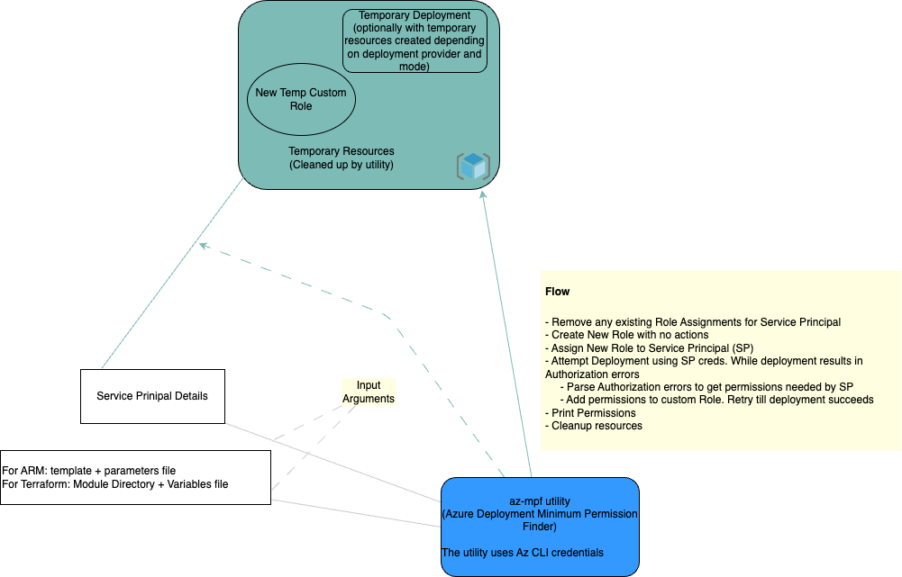

# az-mpf utility (Azure ARM Template Deployment Minimum Permissions Finder)

This utility finds the minimum permissions required by a Service Principal to deploy a given ARM template. This can help when you need to figure out the details of what permissions a service principal or managed identity will need to deploy a given ARM template. Similarly when assigning a Service Principle / Managed Identity to an Azure Policy Assignment, this utility can help you figure out the minimum permissions required by the Service Principal / Managed Identity to enforce/remediate the policy.

Sample output of this utility when deploying an [ARM template](./templates/samples/aks.json) which just creates an AKS cluster is as follows:

```shell
# Text output
./az-mpf -subscriptionID=${SUBSCRIPTION_ID} -spClientID="${SP_CLIENT_ID}" -spObjectID=${SP_OBJECT_ID} -spClientSecret="${SP_CLIENT_SECRET}" -tenantID="${TENANT_ID}" -templateFile="./templates/samples/aks.json" -parametersFile="./templates/samples/aks-parameters.json"
------------------------------------------------------------------------------------------------------------------------------------------
Permissions Assigned to Service Principal for Resource Group:  /subscriptions/SSSSSSSS-SSSS-SSSS-SSSS-SSSSSSSSSSSS/resourceGroups/testdeployrg-IG5UtHN
------------------------------------------------------------------------------------------------------------------------------------------
Microsoft.ContainerService/managedClusters/read
Microsoft.ContainerService/managedClusters/write
Microsoft.Resources/deployments/read
Microsoft.Resources/deployments/write
------------------------------------------------------------------------------------------------------------------------------------------
```

Is is also possible to additionally view detailed resource level permissions required as shown in the Samples section below.

## How It works

The overview of how this utility works is as follows:


Following is the detailed flow of how this utility works:
* The key parameters the utility needs are the **Service Principal details** (Client ID, Secret and Object ID), the ARM template and parameters file.
* The utility **removes any existing Role Assignments for provided Service Principal**
* A new Resource Group and Custom Role (with no assigned permissions) are created
* The Service Principal (SP) is assigned the new custom role
* For the above steps the utitity uses the **default Azure CLI credentials** which needs to have permissions to create custom role, resource group, and role assignments
* For the following sub steps the **Service Principal Credentials** are used. These sub steps are re-tried till the deployment succeeds
  * Attempt to deploy ARM template using template and parameters file
  * Check if Authorization errors have occured. Parse Authorization errors to fetch the scopes and corresponding permissions for which errors have occured. The [authorizationErrorParser Tests](./authorizationErrorParser_test.go) provide details of the kinds of Authorization erros typically received.
  * Add the missing permissions to custom Role. This sub step uses **default Azure CLI credentials** to update role permissions.
* Print the Permissions. There are options provided to view the resource wise break up of permissions and also to export the result in JSON format
* Cleanup Role Assignments, Custom Role and Resource Group created by the utility.

## Installation

You can download the latest version for your platform from the [releases](https://github.com/maniSbindra/az-mpf/releases/) link.

For example, to download the latest version for Windows:

```shell
curl -L https://github.com/maniSbindra/az-mpf/releases/download/v0.2.0/az-mpf-windows-amd64.exe -o az-mpf.exe
```

And for Mac Arm64:
  
```shell
curl -L https://github.com/maniSbindra/az-mpf/releases/download/v0.2.0/az-mpf-darwin-arm64 -o az-mpf
``` 

## Building Locally

You can also build locally by cloning this repo and running `make build`.

## Debugging Locally

The [launch.json](.vscode/launch.json) file has been configured to debug the application locally. The values for the required arguments are passed via the .env.sh file. The following is a sample .env.sh file:

```shell
SUBSCRIPTION_ID="YOUR_SUBSCRIPTION_ID"
TENANT_ID="YOUR_TENANT_ID"
# TEST_DEPLOYMENT_NAME_PFX="testDeploy"
# TEST_DEPLOYMENT_RESOURCE_GROUP_NAME_PFX="testdeployrg"
SP_CLIENT_ID="YOUR_SP_CLIENT_ID"
SP_CLIENT_SECRET="YOUR_SP_CLIENT_SECRET"
SP_OBJECT_ID="YOUR_SP_OBJECT_ID"
TEMPLATE_FILE="./templates/samples/aks.json"
PARAMETERS_FILE="./templates/samples/aks-parameters.json"
```

These values need to be modified to match your environment. You can also modify the launch.json to change the logging verbosity, which is debug by default while debugging.

## Usage Details

### Parameters
Parameters can be supplied to the utility either via command line or via environment variables. The following parameters are supported:

| Parameter                  | Environment Variable           | Required / Optional | Description                                      |
|--------------------------- | ------------------------------ | ------------------- | -----------------------------------------------  |
| subscriptionID             | SUBSCRIPTION_ID                | Required            |                                                 |
| tenantID                   | TENANT_ID                      | Required            |                                                 |
| servicePrincipalClientID   | SP_CLIENT_ID                   | Required            |                                                 |
| servicePrincipalObjectID   | SP_OBJECT_ID                   | Required            | Note this is the SP Object id and is different from the Client ID                                               |
| servicePrincipalClientSecret | SP_CLIENT_SECRET             | Required            |                                                 |
| templateFilePath           | TEMPLATE_FILE                  | Required            | ARM template file with path                     |
| parametersFilePath         | PARAMETERS_FILE                | Required            | ARM template parameters file with path          |
| resourceGroupNamePfx       | TEST_DEPLOYMENT_RESOURCE_GROUP_NAME_PFX | Optional     | Prefix for the resource group name. If not provided, default prefix is testdeployrg |
| deploymentNamePfx          | TEST_DEPLOYMENT_NAME_PFX       | Optional            | Prefix for the deployment name. If not provided, default prefix is testDeploy |
| showDetailedOutput         | N/A                            | Optional            | If set to true, the output shows details of permissions resource wise as well |
| jsonOutput                 | N/A                            | Optional            | If set to true, the output is printed in JSON format |
| location                   | N/A                            | Optional            | Location for the resource group. If not provided, default location is eastus |


### Detailed output
The utility by default prints the permissions assigned to the SP at resource group level. It is also possible to view additional details of the permissions at a resource level. The following is a sample of detailed output:
```shell
# Detailed Text output
./az-mpf -subscriptionID=${SUBSCRIPTION_ID} -spClientID="${SP_CLIENT_ID}" -spObjectID=${SP_OBJECT_ID} -spClientSecret="${SP_CLIENT_SECRET}" -tenantID="${TENANT_ID}" -templateFile="./templates/samples/aks.json" -parametersFile="./templates/samples/aks-parameters.json" -showDetailedOutput
------------------------------------------------------------------------------------------------------------------------------------------
Permissions Assigned to Service Principal for Resource Group:  /subscriptions/SSSSSSSS-SSSS-SSSS-SSSS-SSSSSSSSSSSS/resourceGroups/testdeployrg-Lep7SYp
------------------------------------------------------------------------------------------------------------------------------------------
Microsoft.ContainerService/managedClusters/read
Microsoft.ContainerService/managedClusters/write
Microsoft.Resources/deployments/read
Microsoft.Resources/deployments/write
------------------------------------------------------------------------------------------------------------------------------------------


Break down of permissions by different resource types:

Permissions required for /subscriptions/SSSSSSSS-SSSS-SSSS-SSSS-SSSSSSSSSSSS/resourceGroups/testdeployrg-Lep7SYp/providers/Microsoft.ContainerService/managedClusters/aks101cluster: 
Microsoft.ContainerService/managedClusters/read
Microsoft.ContainerService/managedClusters/write
--------------


Permissions required for /subscriptions/SSSSSSSS-SSSS-SSSS-SSSS-SSSSSSSSSSSS/resourcegroups/testdeployrg-Lep7SYp/providers/Microsoft.Resources/deployments/testDeploy-PQRvlnp: 
Microsoft.Resources/deployments/read
Microsoft.Resources/deployments/write
--------------
```

### JSON Output which by default shows the details as well
It is possible to also get the JSON output, which by default shows details as well. The following is a sample of JSON output:
```shell
./az-mpf -subscriptionID=${SUBSCRIPTION_ID} -spClientID="${SP_CLIENT_ID}" -spObjectID=${SP_OBJECT_ID} -spClientSecret="${SP_CLIENT_SECRET}" -tenantID="${TENANT_ID}" -templateFile="./templates/samples/aks.json" -parametersFile="./templates/samples/aks-parameters.json" -jsonOutput
{
  "/subscriptions/SSSSSSSS-SSSS-SSSS-SSSS-SSSSSSSSSSSS/resourceGroups/testdeployrg-ZPWHSnh": [
    "Microsoft.ContainerService/managedClusters/read",
    "Microsoft.ContainerService/managedClusters/write",
    "Microsoft.Resources/deployments/read",
    "Microsoft.Resources/deployments/write"
  ],
  "/subscriptions/SSSSSSSS-SSSS-SSSS-SSSS-SSSSSSSSSSSS/resourceGroups/testdeployrg-ZPWHSnh/providers/Microsoft.ContainerService/managedClusters/aks101cluster": [
    "Microsoft.ContainerService/managedClusters/read",
    "Microsoft.ContainerService/managedClusters/write"
  ],
  "/subscriptions/SSSSSSSS-SSSS-SSSS-SSSS-SSSSSSSSSSSS/resourcegroups/testdeployrg-ZPWHSnh/providers/Microsoft.Resources/deployments/testDeploy-mDDckQC": [
    "Microsoft.Resources/deployments/read",
    "Microsoft.Resources/deployments/write"
  ]
}
```

### Viewing info, warn or debug level logs
By default the log level is error. More verbose logs can be viewed by setting the LOG_LEVEL environment variable to info, warn or debug. The following is a sample of info level logs:

```shell
LOG_LEVEL=info ./az-mpf -subscriptionID=${SUBSCRIPTION_ID} -spClientID="${SP_CLIENT_ID}" -spObjectID=${SP_OBJECT_ID} -spClientSecret="${SP_CLIENT_SECRET}" -tenantID="${TENANT_ID}" -templateFile="./templates/samples/aks.json" -parametersFile="./templates/samples/aks-parameters.json"
 LOG_LEVEL=info ./az-mpf -subscriptionID=${SUBSCRIPTION_ID} -spClientID="${SP_CLIENT_ID}" -spObjectID=${SP_OBJECT_ID} -spClientSecret="${SP_CLIENT_SECRET}" -tenantID="${TENANT_ID}" -templateFile="./templates/samples/aks.json" -parametersFile="./templates/samples/aks-parameters.json"
INFO[0004] Getting new Default API Bearer Token         
INFO[0005] roleDefinitionResourceID: /subscriptions/SSSSSSSS-SSSS-SSSS-SSSS-SSSSSSSSSSSS/providers/Microsoft.Authorization/roleDefinitions/cef574b4-f3c1-4400-b6e8-82bb7fffe637 
INFO[0005] Creating Resource Group: testdeployrg-TIhoxAy  
INFO[0012] Resource Group: testdeployrg-TIhoxAy created successfully  
INFO[0014] Deleted all existing role assignments for service principal  
INFO[0014] Initializing Custom Role                     
INFO[0016] Custom role initialized successfully         
INFO[0016] Assigning new custom role to service principal 
INFO[0018] New Custom Role assigned to service principal successfully 
INFO[0019] Successfully Parsed Deployment Authorization Error 
INFO[0019] Adding mising scopes/permissions to final result map... 
INFO[0019] Adding permission/scope to role...........   
INFO[0020] Permission/scope added to role successfully  
INFO[0026] Successfully Parsed Deployment Authorization Error 
INFO[0026] Adding mising scopes/permissions to final result map... 
INFO[0026] Adding permission/scope to role...........   
INFO[0027] Permission/scope added to role successfully  
INFO[0039] create deployment successful, moving to get deployment... 
INFO[0039] *************************                    
INFO[0040] create deployment and get deployment successful... 
INFO[0040] *************************                    
------------------------------------------------------------------------------------------------------------------------------------------
Permissions Assigned to Service Principal for Resource Group:  /subscriptions/SSSSSSSS-SSSS-SSSS-SSSS-SSSSSSSSSSSS/resourceGroups/testdeployrg-TIhoxAy
------------------------------------------------------------------------------------------------------------------------------------------
Microsoft.ContainerService/managedClusters/read
Microsoft.ContainerService/managedClusters/write
Microsoft.Resources/deployments/read
Microsoft.Resources/deployments/write
------------------------------------------------------------------------------------------------------------------------------------------

INFO[0040] Cleaning up resources...                     
INFO[0040] *************************                    
INFO[0041] Deployment status: Running                   
INFO[0044] Cancelled deployment testDeploy-NWQUACu      
INFO[0048] Role definition deleted successfully         
INFO[0051] Resource group deletion initiated successfully...

```

## Complex ARM template sample
Let us look at the detailed output of a more complex ARM template. The following is the command used to run the sample:

```shell
./az-mpf -subscriptionID=${SUBSCRIPTION_ID} -spClientID="${SP_CLIENT_ID}" -spObjectID=${SP_OBJECT_ID} -spClientSecret="${SP_CLIENT_SECRET}" -tenantID="${TENANT_ID}" -templateFile="./templates/samples/multi-resource-template.json" -parametersFile="./templates/samples/multi-resource-parameters.json" -showDetailedOutput
------------------------------------------------------------------------------------------------------------------------------------------
Permissions Assigned to Service Principal for Resource Group:  /subscriptions/SSSSSSSS-SSSS-SSSS-SSSS-SSSSSSSSSSSS/resourceGroups/testdeployrg-RCPjJ0l
------------------------------------------------------------------------------------------------------------------------------------------
Microsoft.Authorization/roleAssignments/read
Microsoft.Authorization/roleAssignments/write
Microsoft.Compute/virtualMachines/extensions/read
Microsoft.Compute/virtualMachines/extensions/write
Microsoft.Compute/virtualMachines/read
Microsoft.Compute/virtualMachines/write
Microsoft.ContainerRegistry/registries/read
Microsoft.ContainerRegistry/registries/write
Microsoft.ContainerService/managedClusters/read
Microsoft.ContainerService/managedClusters/write
Microsoft.Insights/actionGroups/read
Microsoft.Insights/actionGroups/write
Microsoft.Insights/activityLogAlerts/read
Microsoft.Insights/activityLogAlerts/write
Microsoft.Insights/diagnosticSettings/read
Microsoft.Insights/diagnosticSettings/write
Microsoft.KeyVault/vaults/read
Microsoft.KeyVault/vaults/write
Microsoft.ManagedIdentity/userAssignedIdentities/read
Microsoft.ManagedIdentity/userAssignedIdentities/write
Microsoft.Network/ApplicationGatewayWebApplicationFirewallPolicies/read
Microsoft.Network/ApplicationGatewayWebApplicationFirewallPolicies/write
Microsoft.Network/applicationGateways/read
Microsoft.Network/applicationGateways/write
Microsoft.Network/bastionHosts/read
Microsoft.Network/bastionHosts/write
Microsoft.Network/natGateways/read
Microsoft.Network/natGateways/write
Microsoft.Network/networkInterfaces/read
Microsoft.Network/networkInterfaces/write
Microsoft.Network/networkSecurityGroups/read
Microsoft.Network/networkSecurityGroups/write
Microsoft.Network/privateDnsZones/read
Microsoft.Network/privateDnsZones/virtualNetworkLinks/read
Microsoft.Network/privateDnsZones/virtualNetworkLinks/write
Microsoft.Network/privateDnsZones/write
Microsoft.Network/privateEndpoints/privateDnsZoneGroups/read
Microsoft.Network/privateEndpoints/privateDnsZoneGroups/write
Microsoft.Network/privateEndpoints/read
Microsoft.Network/privateEndpoints/write
Microsoft.Network/publicIPAddresses/read
Microsoft.Network/publicIPAddresses/write
Microsoft.Network/publicIPPrefixes/read
Microsoft.Network/publicIPPrefixes/write
Microsoft.Network/virtualNetworks/read
Microsoft.Network/virtualNetworks/write
Microsoft.OperationalInsights/workspaces/read
Microsoft.OperationalInsights/workspaces/write
Microsoft.OperationsManagement/solutions/read
Microsoft.OperationsManagement/solutions/write
Microsoft.Resources/deployments/read
Microsoft.Resources/deployments/write
Microsoft.Storage/storageAccounts/read
Microsoft.Storage/storageAccounts/write
------------------------------------------------------------------------------------------------------------------------------------------


Break down of permissions by different resource types:

Permissions required for /subscriptions/SSSSSSSS-SSSS-SSSS-SSSS-SSSSSSSSSSSS/resourceGroups/testdeployrg-RCPjJ0l/providers/Microsoft.Storage/storageAccounts/bootcjmcecbyweegy: 
Microsoft.Storage/storageAccounts/read
Microsoft.Storage/storageAccounts/write
--------------


Permissions required for /subscriptions/SSSSSSSS-SSSS-SSSS-SSSS-SSSSSSSSSSSS/resourceGroups/testdeployrg-RCPjJ0l/providers/Microsoft.ManagedIdentity/userAssignedIdentities/aks-cjmcecbyweegyAadPodManagedIdentity: 
Microsoft.ManagedIdentity/userAssignedIdentities/read
Microsoft.ManagedIdentity/userAssignedIdentities/write
--------------


Permissions required for /subscriptions/SSSSSSSS-SSSS-SSSS-SSSS-SSSSSSSSSSSS/resourceGroups/testdeployrg-RCPjJ0l/providers/Microsoft.Network/privateEndpoints/KeyVaultPrivateEndpoint: 
Microsoft.Network/privateEndpoints/read
Microsoft.Network/privateEndpoints/write
--------------


Permissions required for /subscriptions/SSSSSSSS-SSSS-SSSS-SSSS-SSSSSSSSSSSS/resourceGroups/testdeployrg-RCPjJ0l/providers/Microsoft.ContainerRegistry/registries/acrcjmcecbyweegy: 
Microsoft.ContainerRegistry/registries/read
Microsoft.ContainerRegistry/registries/write
--------------


Permissions required for /subscriptions/SSSSSSSS-SSSS-SSSS-SSSS-SSSSSSSSSSSS/resourcegroups/testdeployrg-RCPjJ0l/providers/Microsoft.Resources/deployments/testDeploy-sv3piE0: 
Microsoft.Resources/deployments/read
Microsoft.Resources/deployments/write
--------------


Permissions required for /subscriptions/SSSSSSSS-SSSS-SSSS-SSSS-SSSSSSSSSSSS/resourceGroups/testdeployrg-RCPjJ0l/providers/Microsoft.Authorization/roleAssignments/c6dd9780-8435-53bc-a4e9-774c36ce2b9f: 
Microsoft.Authorization/roleAssignments/read
Microsoft.Authorization/roleAssignments/write
--------------


Permissions required for /subscriptions/SSSSSSSS-SSSS-SSSS-SSSS-SSSSSSSSSSSS/resourceGroups/testdeployrg-RCPjJ0l/providers/Microsoft.Insights/activityLogAlerts/AllAzureAdvisorAlert: 
Microsoft.Insights/activityLogAlerts/read
Microsoft.Insights/activityLogAlerts/write
--------------


Permissions required for /subscriptions/SSSSSSSS-SSSS-SSSS-SSSS-SSSSSSSSSSSS/resourceGroups/testdeployrg-RCPjJ0l/providers/Microsoft.OperationalInsights/workspaces/mantmplawsp131: 
Microsoft.OperationalInsights/workspaces/read
Microsoft.OperationalInsights/workspaces/write
--------------


Permissions required for /subscriptions/SSSSSSSS-SSSS-SSSS-SSSS-SSSSSSSSSSSS/resourceGroups/testdeployrg-RCPjJ0l/providers/Microsoft.Network/privateDnsZones/privatelink.vault.azure.net/virtualNetworkLinks/link_to_aks-cjmcecbyweegyvnet: 
Microsoft.Network/privateDnsZones/virtualNetworkLinks/read
Microsoft.Network/privateDnsZones/virtualNetworkLinks/write
--------------


Permissions required for /subscriptions/SSSSSSSS-SSSS-SSSS-SSSS-SSSSSSSSSSSS/resourceGroups/testdeployrg-RCPjJ0l/providers/Microsoft.OperationsManagement/solutions/ContainerInsights(mantmplawsp131): 
Microsoft.OperationsManagement/solutions/read
Microsoft.OperationsManagement/solutions/write
--------------


Permissions required for /subscriptions/SSSSSSSS-SSSS-SSSS-SSSS-SSSSSSSSSSSS/resourceGroups/testdeployrg-RCPjJ0l/providers/Microsoft.Network/publicIPAddresses/aks-cjmcecbyweegyBastionPublicIp: 
Microsoft.Network/publicIPAddresses/read
Microsoft.Network/publicIPAddresses/write
--------------


Permissions required for /subscriptions/SSSSSSSS-SSSS-SSSS-SSSS-SSSSSSSSSSSS/resourceGroups/testdeployrg-RCPjJ0l/providers/Microsoft.Network/publicIPPrefixes/aks-cjmcecbyweegyPublicIpPrefix: 
Microsoft.Network/publicIPPrefixes/read
Microsoft.Network/publicIPPrefixes/write
--------------


Permissions required for /subscriptions/SSSSSSSS-SSSS-SSSS-SSSS-SSSSSSSSSSSS/resourceGroups/testdeployrg-RCPjJ0l/providers/Microsoft.Network/networkSecurityGroups/VmSubnetNsg/providers/Microsoft.Insights/diagnosticSettings/default: 
Microsoft.Insights/diagnosticSettings/read
Microsoft.Insights/diagnosticSettings/write
--------------


Permissions required for /subscriptions/SSSSSSSS-SSSS-SSSS-SSSS-SSSSSSSSSSSS/resourceGroups/testdeployrg-RCPjJ0l/providers/Microsoft.Network/bastionHosts/aks-cjmcecbyweegyBastion: 
Microsoft.Network/bastionHosts/read
Microsoft.Network/bastionHosts/write
--------------


Permissions required for /subscriptions/SSSSSSSS-SSSS-SSSS-SSSS-SSSSSSSSSSSS/resourceGroups/testdeployrg-RCPjJ0l/providers/Microsoft.Compute/virtualMachines/TestVm: 
Microsoft.Compute/virtualMachines/read
Microsoft.Compute/virtualMachines/write
--------------


Permissions required for /subscriptions/SSSSSSSS-SSSS-SSSS-SSSS-SSSSSSSSSSSS/resourceGroups/testdeployrg-RCPjJ0l/providers/Microsoft.Network/privateDnsZones/privatelink.blob.core.windows.net: 
Microsoft.Network/privateDnsZones/read
Microsoft.Network/privateDnsZones/write
--------------


Permissions required for /subscriptions/SSSSSSSS-SSSS-SSSS-SSSS-SSSSSSSSSSSS/resourceGroups/testdeployrg-RCPjJ0l/providers/Microsoft.Network/privateEndpoints/AcrPrivateEndpoint: 
Microsoft.Network/privateEndpoints/read
Microsoft.Network/privateEndpoints/write
--------------


Permissions required for /subscriptions/SSSSSSSS-SSSS-SSSS-SSSS-SSSSSSSSSSSS/resourceGroups/testdeployrg-RCPjJ0l/providers/Microsoft.Network/applicationGateways/appgw-cjmcecbyweegy: 
Microsoft.Network/applicationGateways/read
Microsoft.Network/applicationGateways/write
--------------


Permissions required for /subscriptions/SSSSSSSS-SSSS-SSSS-SSSS-SSSSSSSSSSSS/resourceGroups/testdeployrg-RCPjJ0l/providers/Microsoft.Authorization/roleAssignments/2fb16be8-a859-533e-b958-a493bb46a0cc: 
Microsoft.Authorization/roleAssignments/read
Microsoft.Authorization/roleAssignments/write
--------------


Permissions required for /subscriptions/SSSSSSSS-SSSS-SSSS-SSSS-SSSSSSSSSSSS/resourceGroups/testdeployrg-RCPjJ0l/providers/Microsoft.KeyVault/vaults/keyvault-cjmcecbyweegy: 
Microsoft.KeyVault/vaults/read
Microsoft.KeyVault/vaults/write
--------------


Permissions required for /subscriptions/SSSSSSSS-SSSS-SSSS-SSSS-SSSSSSSSSSSS/resourceGroups/testdeployrg-RCPjJ0l/providers/Microsoft.Compute/virtualMachines/TestVm/extensions/LogAnalytics: 
Microsoft.Compute/virtualMachines/extensions/read
Microsoft.Compute/virtualMachines/extensions/write
--------------


Permissions required for /subscriptions/SSSSSSSS-SSSS-SSSS-SSSS-SSSSSSSSSSSS/resourceGroups/testdeployrg-RCPjJ0l/providers/Microsoft.Compute/virtualMachines/TestVm/extensions/DependencyAgent: 
Microsoft.Compute/virtualMachines/extensions/read
Microsoft.Compute/virtualMachines/extensions/write
--------------


Permissions required for /subscriptions/SSSSSSSS-SSSS-SSSS-SSSS-SSSSSSSSSSSS/resourceGroups/testdeployrg-RCPjJ0l/providers/Microsoft.ManagedIdentity/userAssignedIdentities/appgw-cjmcecbyweegyManagedIdentity: 
Microsoft.ManagedIdentity/userAssignedIdentities/read
Microsoft.ManagedIdentity/userAssignedIdentities/write
--------------


Permissions required for /subscriptions/SSSSSSSS-SSSS-SSSS-SSSS-SSSSSSSSSSSS/resourceGroups/testdeployrg-RCPjJ0l/providers/Microsoft.ContainerService/managedClusters/aks-cjmcecbyweegy: 
Microsoft.ContainerService/managedClusters/read
Microsoft.ContainerService/managedClusters/write
--------------


Permissions required for /subscriptions/SSSSSSSS-SSSS-SSSS-SSSS-SSSSSSSSSSSS/resourceGroups/testdeployrg-RCPjJ0l/providers/Microsoft.Network/privateDnsZones/privatelink.azurecr.io/virtualNetworkLinks/link_to_aks-cjmcecbyweegyvnet: 
Microsoft.Network/privateDnsZones/virtualNetworkLinks/read
Microsoft.Network/privateDnsZones/virtualNetworkLinks/write
--------------


Permissions required for /subscriptions/SSSSSSSS-SSSS-SSSS-SSSS-SSSSSSSSSSSS/resourceGroups/testdeployrg-RCPjJ0l/providers/Microsoft.Network/natGateways/aks-cjmcecbyweegyNatGateway: 
Microsoft.Network/natGateways/read
Microsoft.Network/natGateways/write
--------------


Permissions required for /subscriptions/SSSSSSSS-SSSS-SSSS-SSSS-SSSSSSSSSSSS/resourceGroups/testdeployrg-RCPjJ0l/providers/Microsoft.Network/privateEndpoints/BlobStorageAccountPrivateEndpoint: 
Microsoft.Network/privateEndpoints/read
Microsoft.Network/privateEndpoints/write
--------------


Permissions required for /subscriptions/SSSSSSSS-SSSS-SSSS-SSSS-SSSSSSSSSSSS/resourceGroups/testdeployrg-RCPjJ0l/providers/Microsoft.Insights/actionGroups/emailActionGroupName: 
Microsoft.Insights/actionGroups/read
Microsoft.Insights/actionGroups/write
--------------


Permissions required for /subscriptions/SSSSSSSS-SSSS-SSSS-SSSS-SSSSSSSSSSSS/resourceGroups/testdeployrg-RCPjJ0l/providers/Microsoft.Network/ApplicationGatewayWebApplicationFirewallPolicies/appgw-cjmcecbyweegyWafPolicy: 
Microsoft.Network/ApplicationGatewayWebApplicationFirewallPolicies/read
Microsoft.Network/ApplicationGatewayWebApplicationFirewallPolicies/write
--------------


Permissions required for /subscriptions/SSSSSSSS-SSSS-SSSS-SSSS-SSSSSSSSSSSS/resourceGroups/testdeployrg-RCPjJ0l/providers/Microsoft.Network/bastionHosts/aks-cjmcecbyweegyBastion/providers/Microsoft.Insights/diagnosticSettings/default: 
Microsoft.Insights/diagnosticSettings/read
Microsoft.Insights/diagnosticSettings/write
--------------


Permissions required for /subscriptions/SSSSSSSS-SSSS-SSSS-SSSS-SSSSSSSSSSSS/resourceGroups/testdeployrg-RCPjJ0l/providers/Microsoft.Network/networkSecurityGroups/VmSubnetNsg: 
Microsoft.Network/networkSecurityGroups/read
Microsoft.Network/networkSecurityGroups/write
--------------


Permissions required for /subscriptions/SSSSSSSS-SSSS-SSSS-SSSS-SSSSSSSSSSSS/resourceGroups/testdeployrg-RCPjJ0l/providers/Microsoft.Network/privateEndpoints/KeyVaultPrivateEndpoint/privateDnsZoneGroups/vaultPrivateDnsZoneGroup: 
Microsoft.Network/privateEndpoints/privateDnsZoneGroups/read
Microsoft.Network/privateEndpoints/privateDnsZoneGroups/write
--------------


Permissions required for /subscriptions/SSSSSSSS-SSSS-SSSS-SSSS-SSSSSSSSSSSS/resourceGroups/testdeployrg-RCPjJ0l/providers/Microsoft.Network/privateEndpoints/BlobStorageAccountPrivateEndpoint/privateDnsZoneGroups/blobPrivateDnsZoneGroup: 
Microsoft.Network/privateEndpoints/privateDnsZoneGroups/read
Microsoft.Network/privateEndpoints/privateDnsZoneGroups/write
--------------


Permissions required for /subscriptions/SSSSSSSS-SSSS-SSSS-SSSS-SSSSSSSSSSSS/resourceGroups/testdeployrg-RCPjJ0l/providers/Microsoft.Network/networkInterfaces/TestVmNic: 
Microsoft.Network/networkInterfaces/read
Microsoft.Network/networkInterfaces/write
--------------


Permissions required for /subscriptions/SSSSSSSS-SSSS-SSSS-SSSS-SSSSSSSSSSSS/resourceGroups/testdeployrg-RCPjJ0l/providers/Microsoft.Authorization/roleAssignments/2acb4ee0-f4d7-5dff-9b3a-545fa3e8e526: 
Microsoft.Authorization/roleAssignments/read
Microsoft.Authorization/roleAssignments/write
--------------


Permissions required for /subscriptions/SSSSSSSS-SSSS-SSSS-SSSS-SSSSSSSSSSSS/resourceGroups/testdeployrg-RCPjJ0l/providers/Microsoft.Network/privateEndpoints/AcrPrivateEndpoint/privateDnsZoneGroups/registryPrivateDnsZoneGroup: 
Microsoft.Network/privateEndpoints/privateDnsZoneGroups/read
Microsoft.Network/privateEndpoints/privateDnsZoneGroups/write
--------------


Permissions required for /subscriptions/SSSSSSSS-SSSS-SSSS-SSSS-SSSSSSSSSSSS/resourceGroups/testdeployrg-RCPjJ0l/providers/Microsoft.Network/privateDnsZones/privatelink.azurecr.io: 
Microsoft.Network/privateDnsZones/read
Microsoft.Network/privateDnsZones/write
--------------


Permissions required for /subscriptions/SSSSSSSS-SSSS-SSSS-SSSS-SSSSSSSSSSSS/resourceGroups/testdeployrg-RCPjJ0l/providers/Microsoft.Network/privateDnsZones/privatelink.vault.azure.net: 
Microsoft.Network/privateDnsZones/read
Microsoft.Network/privateDnsZones/write
--------------


Permissions required for /subscriptions/SSSSSSSS-SSSS-SSSS-SSSS-SSSSSSSSSSSS/resourceGroups/testdeployrg-RCPjJ0l/providers/Microsoft.ManagedIdentity/userAssignedIdentities/aks-cjmcecbyweegyManagedIdentity: 
Microsoft.ManagedIdentity/userAssignedIdentities/read
Microsoft.ManagedIdentity/userAssignedIdentities/write
--------------


Permissions required for /subscriptions/SSSSSSSS-SSSS-SSSS-SSSS-SSSSSSSSSSSS/resourceGroups/testdeployrg-RCPjJ0l/providers/Microsoft.Network/virtualNetworks/aks-cjmcecbyweegyVnet: 
Microsoft.Network/virtualNetworks/read
Microsoft.Network/virtualNetworks/write
--------------


Permissions required for /subscriptions/SSSSSSSS-SSSS-SSSS-SSSS-SSSSSSSSSSSS/resourceGroups/testdeployrg-RCPjJ0l/providers/Microsoft.Network/privateDnsZones/privatelink.blob.core.windows.net/virtualNetworkLinks/link_to_aks-cjmcecbyweegyvnet: 
Microsoft.Network/privateDnsZones/virtualNetworkLinks/read
Microsoft.Network/privateDnsZones/virtualNetworkLinks/write
--------------
```


